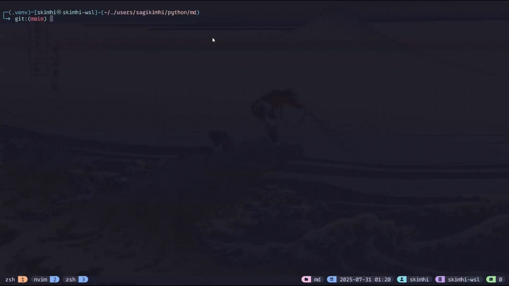

# MD

Markdown editor and live-preview directly from your terminal.



## Installation & Usage

There are multiple options for running `md`, choose the one that fits you the most.

Personally, I recommend using `uv` using either `uvx` or `uv tool` subcommand as its the simplest and quickest way and would also install and manage the appropriate python version for you if it is missing for some reason.

### Option 1

Install as tool with `uv tool` (`uv` must be installed):

```sh
uv tool install git+https://github.com/sagikimhi/md.git
```

Afterwards you should simply be able to run `md` from the terminal to launch the TUI (Terminal UI).

If you are like me, you probably already have `md` aliased to something like mkdir, in which case you will have to run `uv tool run md` instead.

### Option 2

Run directly from repo with `uvx` (`uv` must be installed):

```sh
uvx --from git+https://github.com/sagikimhi/md.git -q md
```

### Option 3

Run directly from repo with `pipx`:

```sh
pipx run --spec git+https://github.com/sagikimhi/md.git -q md
```

### Option 4

Create a virtual environment

```sh
# if you have `uv` installed
uv venv
# otherwise, set it up using python
python3 -m venv .venv
```

Activate the virtual environment

```sh
# in `bash` or similar shell
source .venv/bin/activate
# in `tcsh` or similar shell
source .venv/bin/activate.csh
# in `fish` shell
source .venv/bin/activate.fish
```

Once virtual environment has been activated, install the package:

```sh
# using `uv`
uv add git+https://github.com/sagikimhi/md.git
# using `pip`
pip install git+https://github.com/sagikimhi/md.git
```

Alternatively, if you'd rather install over ssh:

```sh
# using `uv` (note that im using '/sagikimhi' and not ':sagikimhi')
uv add git+ssh://git@github.com/sagikimhi/md.git
# using `pip`
pip install git+ssh://git@github.com/sagikimhi/md.git
```

## Development

Im not sure if or when I will continue working on this.

This is just a simple tool I felt like I really needed for myself, and thanks to [Textual](https://textual.textualize.io/), I could finally write it and spend no more than a couple of hours on it which is simply awesome!

In any case, contributions are always welcome, although issues w/o a PR will most likely be ignored as I simply don't have the time to maintain this.

Also feel free to fork and extend this as you wish.

## Textual

I really recommend you to check out [Textual](https://textual.textualize.io/) if you haven't done so already, it is simply awesome and amazing and is what inspired this app in the firstplace and the only thing that made it possible to write in such a short time window.

Seriously, check it out! it is truly amazing! (Thank you [Will](https://github.com/willmcgugan)🤩)
